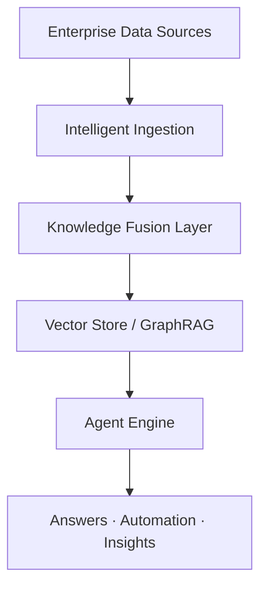

# <p align="center">Clouisle</p>

<p align="center"><b>An Enterprise-Grade Intelligent Knowledge Platform That Evolves With Your Business</b></p>

<p align="center">
Turn fragmented enterprise data into actionable intelligence — continuously, securely, and at scale.
</p>

<p align="center">


<a href="https://github.com/yunhai-dev/Clouisle/actions/workflows/ci.yml">
  
</a>
</p>

<p align="center">
<a href="docs/README_zh-CN.md">简体中文</a> ·
<a href="#why-clouisle">Why Clouisle</a> ·
<a href="#architecture">Architecture</a> ·
<a href="#quick-start">Quick Start</a> ·
<a href="#use-cases">Use Cases</a>
</p>

---

## Why Clouisle?

Modern enterprises don’t suffer from a lack of data —
they suffer from **data fragmentation, low reusability, and zero intelligence execution**.

Knowledge lives everywhere:

* Documents
* Databases
* Chats
* Wikis
* Internal tools

But when decisions need to be made, that knowledge is **static**, **siloed**, and **non-actionable**.

**Clouisle exists to change that.**

Clouisle is not just a knowledge base.
It is an **evolving intelligence layer** that continuously transforms enterprise data into **context-aware, agent-driven execution**.

> Think of Clouisle as a **living system**, not a storage solution.

---

## What Makes Clouisle Different?

### 1️⃣ From Storage to Intelligence

Traditional knowledge systems stop at *search*.
Clouisle goes further — enabling **reasoning, decision-making, and action**.

* Understands relationships, not just keywords
* Connects knowledge across domains
* Executes workflows through intelligent agents

---

### 2️⃣ Built for Enterprise Reality

Clouisle is designed for **real-world enterprise constraints**:

* Distributed systems
* Large-scale data
* Security & compliance
* Incremental adoption

Every core capability is **modular, loosely coupled, and independently scalable**.

---

### 3️⃣ Agent-Native by Design

AI is not an add-on in Clouisle — it’s the foundation.

Agents in Clouisle can:

* Retrieve and reason over knowledge
* Perform multi-step tasks
* Integrate with internal systems
* Automate repeatable workflows

They don’t just answer questions — **they get work done**.

---

## Core Capabilities

### 🧠 Intelligent Knowledge Evolution Engine

**Ingestion**

* Files, databases, APIs, collaboration tools
* Continuous synchronization
* Schema-agnostic and extensible

**Knowledge Fusion**

* Empowering Knowledge Retrieval with Intelligent Agents (Agentic RAG)
* Distributed vector search
* High-precision, low-latency retrieval

**Agent Intelligence**

* Low-code agent creation
* Agentic RAG workflows
* Execution-oriented reasoning

---

## Architecture



Designed to scale horizontally, deploy flexibly, and evolve continuously.

---

## Quick Start

### Infrastructure

```bash
docker-compose -f deploy/docker-compose.yml up -d
```

### Backend

```bash
cd backend
uv sync
uvicorn app.main:app --reload
```

### Frontend

```bash
cd frontend
bun install
bun dev
```

---

## Use Cases

| Use Case                     | Outcome                                                        |
| ---------------------------- | -------------------------------------------------------------- |
| **Enterprise Q&A**           | Accurate, context-aware answers grounded in internal knowledge |
| **Engineering Productivity** | Faster onboarding, fewer repeated questions, instant context   |
| **Compliance & Risk**        | Automated contract and policy analysis                         |
| **Decision Intelligence**    | Cross-system insights for executives and analysts              |

---

## Roadmap

* [x] Distributed vector retrieval
* [x] Multimodal document understanding
* [x] Agentic RAG foundation
* [ ] Industry-specific agent templates
* [ ] Deeper workflow automation

---

## License

Clouisle is open-sourced under the **GPL v3** license.

---

<p align="center">
⭐ Star us to support the project · PRs are welcome · Build the future of enterprise intelligence together
</p>


