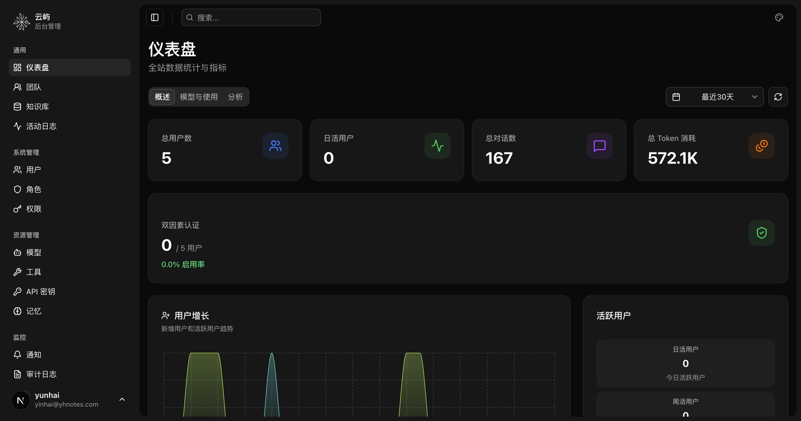

<p align="center">
  
</p>

# <p align="center">Clouisle</p>

<p align="center"><b>An Enterprise-Grade AI Agent & Knowledge Base Platform</b></p>

<p align="center">
Build, deploy, and manage intelligent AI agents with advanced knowledge retrieval and workflow automation.
</p>

<p align="center">


<a href="https://github.com/yunhai-dev/Clouisle/actions/workflows/ci.yml">
  
</a>
</p>

<p align="center">
<a href="https://clouisle.asia">Official Website</a> ·
<a href="docs/guide/README_zh-CN.md">简体中文</a> ·
<a href="#features">Features</a> ·
<a href="#quick-start">Quick Start</a> ·
<a href="#architecture">Architecture</a> ·
<a href="#documentation">Documentation</a>
</p>

---

## Table of Contents

- [Why Clouisle](#why-clouisle)
- [Features](#features)
- [Quick Start](#quick-start)
- [Architecture](#architecture)
- [Configuration](#configuration)
- [Use Cases](#use-cases)
- [Roadmap](#roadmap)
- [Documentation](#documentation)
- [Contributing](#contributing)
- [License](#license)

---



---

## Why Clouisle?

Modern enterprises face a common challenge: **data fragmentation, low reusability, and zero intelligence execution**. Knowledge is scattered across documents, databases, wikis, and internal tools — but when decisions need to be made, that knowledge remains static and non-actionable.

**Clouisle transforms this reality** by providing:

- **Intelligent Knowledge Management**: Not just storage, but understanding and reasoning over your data
- **Agent-Native Architecture**: AI agents that retrieve, reason, and execute — not just answer questions
- **Enterprise-Grade Security**: Multi-tenancy, RBAC, SSO, audit logging, and compliance-ready features
- **Flexible Integration**: Support for 15+ LLM providers and extensible tool system

> Think of Clouisle as a **living intelligence layer** that evolves with your business.

---

## Features

### AI Agent Management

- **Multi-Model Support**: Configure agents with different LLM providers and parameters
- **RAG Integration**: Three retrieval modes — disabled, citation, and rewrite
- **Knowledge Base Binding**: Connect agents to specific knowledge bases for context-aware responses
- **Tool Integration**: Extend agent capabilities with built-in and custom tools
- **Visibility Control**: Private, team, or public access levels
- **Conversation Management**: Multi-turn conversations with history, versioning, and token tracking

### Visual Workflow Builder

- **No-Code Interface**: Drag-and-drop workflow creation
- **15+ Node Types**: Including LLM, Condition, Code Execution, HTTP Request, Tool, Sub-workflow, and more
- **Execution Modes**: Manual, scheduled, webhook, or API triggers
- **Real-Time Monitoring**: Streaming execution with live status updates
- **Debug Mode**: Test workflows before deployment

### Knowledge Base System

- **Multi-Format Support**: PDF, DOCX, XLSX, and more via MarkItDown
- **Intelligent Chunking**: Configurable chunking strategies with preview and editing
- **Vector Search**: Qdrant-powered similarity search with configurable thresholds
- **Async Processing**: Background document processing via Celery

### LLM Provider Support

Supports 15+ providers out of the box:

| Provider | Models |
|----------|--------|
| OpenAI | GPT-4o, GPT-4, GPT-3.5 |
| Anthropic | Claude 3.5 Sonnet, Opus, Haiku (with thinking mode) |
| Google | Gemini Pro, Flash |
| xAI | Grok |
| DeepSeek | DeepSeek-V3, R1 |
| Azure OpenAI | All Azure-hosted models |
| Moonshot | Kimi |
| Zhipu | GLM-4 |
| Qwen | Alibaba Qwen series |
| Ollama | Local models |
| Custom | Any OpenAI-compatible endpoint |

### Enterprise Features

- **Multi-Tenancy**: Team-based resource isolation and management
- **RBAC**: Granular permission system with custom roles
- **SSO**: OIDC, OAuth2, SAML 2.0, and CAS support
- **Audit Logging**: Comprehensive action tracking with before/after snapshots
- **Notification System**: In-app, email, DingTalk, WeChat Work, Feishu, Slack, and webhook channels
- **API Key Management**: Scoped access with expiration and usage tracking

### Tool System

- **Built-in Tools**: Time/Date, Calculator, Web Search (Tavily), File Parser
- **Custom Tools**: HTTP API tools with authentication support
- **MCP Integration**: Model Context Protocol for advanced tool capabilities
- **Sandboxed Execution**: Secure code execution environment

---

## Quick Start

### Prerequisites

- Docker & Docker Compose
- Python 3.13+ with [uv](https://github.com/astral-sh/uv)
- [Bun](https://bun.sh/) 1.0+

### 1. Start Infrastructure

```bash
# Start PostgreSQL, Redis, and Qdrant
docker-compose -f deploy/docker-compose.dev.yml up -d
```

### 2. Configure Environment

```bash
# Copy environment file
cp .env.example .env

# Generate secure passwords and update .env
# IMPORTANT: Set strong random values for these fields:
#   - SECRET_KEY
#   - POSTGRES_PASSWORD
#   - REDIS_PASSWORD
#   - QDRANT_API_KEY
```

### 3. Start Backend

```bash
# Install dependencies
uv sync --project backend

# Start the API server (database will be auto-initialized on first run)
uv run --project backend main.py server

# In separate terminals, start Celery workers
uv run --project backend main.py worker
uv run --project backend main.py beat
```

### 4. Start Frontend

```bash
cd frontend

# Install dependencies
bun install

# Start development server
bun dev
```

### 5. Access the Application

- **Frontend**: http://localhost:3000
- **API Documentation**: http://localhost:8000/docs
- **Default Admin**: Check `.env` for initial credentials

---

## Architecture

```
┌─────────────────────────────────────────────────────────────────┐
│                         Frontend (Next.js 16)                    │
│  ┌──────────┐  ┌──────────┐  ┌──────────┐  ┌──────────────────┐ │
│  │ Dashboard│  │ Platform │  │   Chat   │  │  Auth (SSO/Login)│ │
│  └──────────┘  └──────────┘  └──────────┘  └──────────────────┘ │
└─────────────────────────────────────────────────────────────────┘
                                  │
                                  ▼
┌─────────────────────────────────────────────────────────────────┐
│                      Backend (FastAPI)                           │
│  ┌──────────┐  ┌──────────┐  ┌──────────┐  ┌──────────────────┐ │
│  │  Agents  │  │ Workflows│  │Knowledge │  │  Users & Teams   │ │
│  │  Engine  │  │  Engine  │  │  Bases   │  │    Management    │ │
│  └──────────┘  └──────────┘  └──────────┘  └──────────────────┘ │
│  ┌──────────┐  ┌──────────┐  ┌──────────┐  ┌──────────────────┐ │
│  │   LLM    │  │   Tool   │  │  Audit   │  │   Notification   │ │
│  │ Adapters │  │  System  │  │ Logging  │  │     Service      │ │
│  └──────────┘  └──────────┘  └──────────┘  └──────────────────┘ │
└─────────────────────────────────────────────────────────────────┘
                                  │
                    ┌─────────────┼─────────────┐
                    ▼             ▼             ▼
             ┌──────────┐  ┌──────────┐  ┌──────────┐
             │PostgreSQL│  │  Redis   │  │  Qdrant  │
             │   (DB)   │  │ (Cache)  │  │ (Vector) │
             └──────────┘  └──────────┘  └──────────┘
```

### Tech Stack

**Backend**
- Framework: FastAPI (Python 3.13)
- ORM: Tortoise ORM with AsyncPG
- Task Queue: Celery + Redis
- Vector DB: Qdrant
- LLM Framework: LangChain + LangGraph

**Frontend**
- Framework: Next.js 16 (App Router)
- Runtime: Bun
- UI: shadcn/ui + Tailwind CSS
- Language: TypeScript

---

## Configuration

### Environment Variables

Key configuration options (see `.env.example` for full list):

| Variable | Description |
|----------|-------------|
| `DATABASE_URL` | PostgreSQL connection string |
| `REDIS_URL` | Redis connection string |
| `QDRANT_URL` | Qdrant vector database URL |
| `SECRET_KEY` | JWT signing key |
| `OPENAI_API_KEY` | OpenAI API key (optional) |
| `ANTHROPIC_API_KEY` | Anthropic API key (optional) |

### Site Settings

Configure via the admin dashboard:

- **General**: Site name, description, branding
- **Security**: Password policies, session timeout, login limits
- **Registration**: Enable/disable, require approval, email verification
- **Email**: SMTP configuration for notifications
- **SSO**: Configure identity providers
- **Notifications**: Auto-notification rules and channels

---

## Documentation

- User and operator docs: [docs/guide/README.md](docs/guide/README.md)
- Developer and architecture docs: [docs/dev/README.md](docs/dev/README.md)

---

## Use Cases

| Use Case | Description |
|----------|-------------|
| **Enterprise Q&A** | Deploy AI agents grounded in your internal knowledge for accurate, context-aware answers |
| **Workflow Automation** | Build no-code workflows that combine LLM reasoning with API integrations |
| **Engineering Productivity** | Accelerate onboarding with instant access to documentation and tribal knowledge |
| **Compliance & Risk** | Automate document analysis for contracts, policies, and regulatory requirements |
| **Customer Support** | Create intelligent support agents with access to product documentation |

---

## Roadmap

- [x] Multi-provider LLM support (15+ providers)
- [x] Visual workflow builder
- [x] Knowledge base with RAG
- [x] Enterprise SSO (OIDC, SAML, OAuth2)
- [x] Multi-channel notifications
- [x] Comprehensive audit logging
- [ ] Industry-specific agent templates
- [ ] Advanced analytics dashboard
- [ ] Plugin marketplace
- [ ] Mobile application

---

## Contributing

We welcome contributions! Please see our [Contributing Guide](CONTRIBUTING.md) for details.

### Development Commands

**Backend**
```bash
uv run ruff check .          # Lint
uv run ruff format .         # Format
uv run mypy app/             # Type check
uv run pytest                # Test
uv run python scripts/check_licenses.py  # Dependency license compliance
```

**Frontend**
```bash
bun run lint                 # Lint
bun run build                # Build
bun run license:check        # Dependency license compliance
```

---

## License

Clouisle is open-sourced under the [GPL v3](LICENSE) license.

---

## Acknowledgments

Built with these amazing open-source projects:

- [FastAPI](https://fastapi.tiangolo.com/) - Modern Python web framework
- [Next.js](https://nextjs.org/) - React framework for production
- [LangChain](https://langchain.com/) - LLM application framework
- [Qdrant](https://qdrant.tech/) - Vector similarity search engine
- [shadcn/ui](https://ui.shadcn.com/) - UI component library

---

<p align="center">
<b>Star us on GitHub</b> to support the project<br>
PRs are welcome · Build the future of enterprise AI together
</p>


