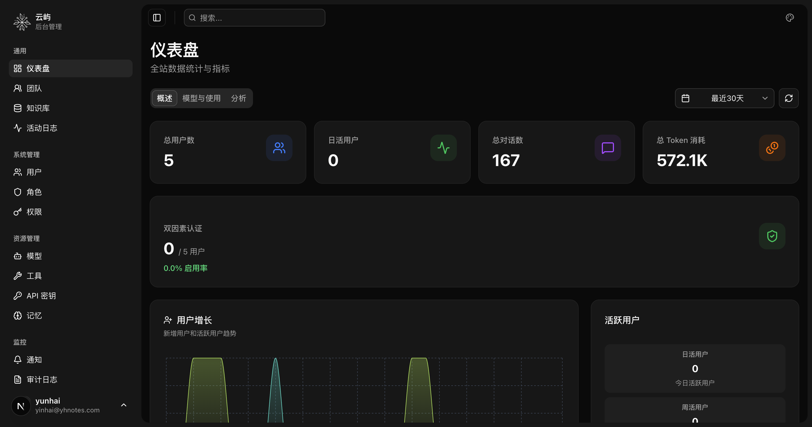

<p align="center">
  
</p>

# <p align="center">Clouisle</p>

<p align="center"><b>Open-Source AI Agent Platform with Workflow Automation & Knowledge Management</b></p>

<p align="center">
Build, deploy, and manage intelligent AI agents with RAG-powered knowledge retrieval, visual workflow automation, and enterprise-grade security.
</p>

<p align="center">


<a href="https://github.com/clouisle/Clouisle/actions/workflows/ci.yml">
  
</a>
</p>

<p align="center">
<a href="https://clouisle.asia">Official Website</a> ·
<a href="docs/guide/README_zh-CN.md">简体中文</a> ·
<a href="#features">Features</a> ·
<a href="#quick-start">Quick Start</a> ·
<a href="#architecture">Architecture</a> ·
<a href="#documentation">Documentation</a>
</p>

---

## Table of Contents

- [Why Clouisle](#why-clouisle)
- [Features](#features)
- [Quick Start](#quick-start)
- [Architecture](#architecture)
- [Configuration](#configuration)
- [Use Cases](#use-cases)
- [Roadmap](#roadmap)
- [Documentation](#documentation)
- [Contributing](#contributing)
- [License](#license)

---



---

## Why Clouisle?

Modern enterprises face a common challenge: **data fragmentation, low reusability, and zero intelligence execution**. Knowledge is scattered across documents, databases, wikis, and internal tools — but when decisions need to be made, that knowledge remains static and non-actionable.

**Clouisle transforms this reality** by providing:

- **Intelligent Knowledge Management**: Hybrid search (vector + lexical) with reranking, configurable chunking, and multi-format document processing
- **Agent-Native Architecture**: AI agents that retrieve, reason, execute tools, and generate media — with streaming, thinking/reasoning mode, and conversation memory
- **Visual Workflow Automation**: Drag-and-drop workflow builder with 15+ node types, versioning, and multiple execution triggers
- **Enterprise-Grade Security**: Multi-tenancy, RBAC, SSO (OIDC/SAML/CAS), TOTP two-factor authentication, and comprehensive audit logging
- **Flexible Integration**: 24+ LLM providers, MCP tool protocol, sandboxed code execution, and API key management

> Think of Clouisle as a **living intelligence layer** that evolves with your business.

---

## Features

### AI Agent Management

- **Multi-Model Support**: Configure agents with different LLM providers, parameters, and thinking/reasoning modes
- **RAG Integration**: Multiple retrieval modes — disabled, citation, and rewrite — with knowledge base binding
- **Streaming & Thinking**: Real-time streaming responses with reasoning/thinking content support
- **Conversation Management**: Multi-turn conversations with branching, manual stop, token usage tracking, and session memory
- **Media Generation**: Built-in support for text-to-image, video, and audio generation within conversations
- **Tool System**: Built-in tools (web search, calculator, file parser), custom HTTP API tools, and MCP protocol integration
- **Context Compression**: Automatic conversation context compression for long-running sessions
- **Visibility Control**: Private, team, or public access levels with RBAC enforcement

### Visual Workflow Builder

- **No-Code Interface**: Drag-and-drop workflow creation with real-time node configuration
- **15+ Node Types**: LLM, Agent, Condition, Code Execution (Python), Knowledge Retriever, HTTP Request, Tool, Sub-workflow, Media Generation, Iteration, and more
- **Execution Triggers**: Manual, scheduled (Cron), webhook, or API — flexible for any use case
- **Versioning**: Draft/publish lifecycle with version history and rollback
- **Real-Time Monitoring**: Streaming execution with live node-level status updates
- **Debug Mode**: Step-by-step testing with variable inspection before deployment
- **Sub-Workflows**: Nest and reuse workflows as sub-workflow nodes
- **Profiling & Metrics**: Execution profiling with per-node latency and cost tracking

### Knowledge Base System

- **Multi-Format Support**: PDF, DOCX, XLSX, Markdown, and more via MarkItDown
- **Hybrid Search**: Vector similarity (Qdrant) + BM25 lexical search (pg_search) with Reciprocal Rank Fusion
- **Configurable Chunking**: Customizable chunk size, overlap, and separator with preview
- **Reranking**: Optional reranking pipeline to improve retrieval accuracy
- **Embedding Management**: Configurable embedding models and vector dimensions
- **Async Document Processing**: Background processing via Celery with status tracking
- **Lexical Search**: PostgreSQL-powered full-text search with Chinese segmentation (jieba)
- **Search Modes**: Vector-only, full-text only, or hybrid with configurable weight tuning

### LLM Provider Support

Supports 24+ providers out of the box, plus any OpenAI-compatible endpoint.

**Chat & Completion**

| Provider | Representative Models |
|---|---|
| OpenAI | GPT-5.6 Sol, GPT-5.6 Terra, GPT-5.6 Luna |
| Anthropic | Claude Opus 5, Fable 5, Mythos 5, Sonnet 5 |
| Google | Gemini 3.6 Flash, Gemini 3.5 Flash-Lite, Gemini 3.1 Pro |
| xAI | Grok 4.5, Grok 4.6 (upcoming), Grok 4.7 (upcoming) |
| Azure OpenAI | GPT-5.6 Sol, GPT-5.6 Luna, GPT-5.4 series |
| DeepSeek | DeepSeek-V4, DeepSeek-V4-Flash |
| Moonshot | Kimi K3 (2.8T params, open-source) |
| Zhipu | GLM-5.2, GLM-4.7 |
| Qwen | Qwen3.8-Max, Qwen3.7-Flash |
| Baichuan | Baichuan-M4 |
| MiniMax | MiniMax-M3 (1M context, multimodal) |
| Volcengine | Doubao 2.1 Pro / Turbo |
| SiliconFlow | GLM-5.2, MiniMax-M3, Nex-N2-Pro, and other open models |
| Ollama | Local models via Ollama |
| Custom | Any OpenAI-compatible endpoint |

**Image, Video & Audio**

| Provider | Latest Models | Modality |
|---|---|---|
| OpenAI | GPT image-2, GPT image-1.5 | Text-to-Image |
| Stability AI | Stable Diffusion 3.5 Large, Stable Audio 3.0 | Image, Audio |
| Midjourney | V8.2, V8.1 | Text-to-Image (via proxy) |
| Google | Imagen 4, Imagen 3 | Text-to-Image |
| Runway | Gen-4.5, Aleph 2.0 | Text-to-Video |
| Pika | Pika 2.5, PikaStream 1.0 | Text-to-Video |
| Luma | Ray3.2, Uni-1.1 | Image, Video |
| Kling | Kling 3.0, Kling IMAGE 3.0 Omni | Image, Video (native 4K) |
| MiniMax | H3, M3 | Image, Video, TTS, Audio |
| Volcengine | Seedance 2.5, Doubao 2.1 Pro | Image, Video, TTS, Audio |
| SiliconFlow | FLUX 1.1 Pro, Wan2.2, CosyVoice2, Fish-Speech | Image, Video, Audio |

### Model Management

- **Multi-Provider**: Centralized model configuration across 24+ providers with standardized interfaces
- **Model Registry**: Register and manage chat, embedding, rerank, TTS, STT, image, and video models
- **Team Authorization**: Granular per-team model access control with daily/monthly token and request quotas
- **Connection Testing**: Built-in model connectivity testing before deployment
- **Default Parameters**: Configurable per-model defaults (temperature, top_p, max_tokens, thinking, etc.)
- **Capability Markers**: Tag models with capabilities (vision, function calling, streaming, etc.)
- **Encrypted Credentials**: Secure API key storage with encryption at rest

### Enterprise Features

- **Multi-Tenancy**: Team-based resource isolation with granular model authorization and quota tracking
- **RBAC**: Role-based permission system with custom roles and permission presets
- **SSO**: OIDC, OAuth2, SAML 2.0, and CAS single sign-on support
- **Two-Factor Authentication**: TOTP-based 2FA for enhanced account security
- **Audit Logging**: Comprehensive action tracking with before/after snapshots and user attribution
- **Notification System**: In-app, email, DingTalk, WeChat Work, Feishu, Slack, and webhook channels
- **API Key Management**: Scoped API keys with expiration, usage tracking, and team access control
- **Site Settings**: Configurable site-wide settings with localization support (en/zh)
- **Password Policies**: Configurable expiration, history, and complexity requirements

### Tool System

- **Built-in Tools**: Time/Date, Calculator, Web Search (Tavily), File Parser, and Python Code Interpreter
- **Custom Tools**: Configurable HTTP API tools with authentication (API key, Bearer, Basic) and variable mapping
- **MCP Integration**: Model Context Protocol for standardized tool capabilities and resource access
- **Sandboxed Execution**: Secure, isolated Python code execution environment with resource limits
- **Tool Registry**: Centralized tool management with credential injection and lifecycle hooks

---

## Quick Start
### Prerequisites

- Docker & Docker Compose

> For development from source, see the [Development Guide](docs/guide/getting-started/development.md).

### 1. Configure Environment

```bash
# Copy the Docker deployment environment file
cp deploy/.env.example deploy/.env

# Edit deploy/.env with secure random values for:
#   SECRET_KEY, POSTGRES_PASSWORD, REDIS_PASSWORD, QDRANT_API_KEY
```

### 2. Start Clouisle

```bash
cd deploy
docker compose --env-file .env up -d
```

### 3. Access the Application

- **Frontend**: http://localhost:3000
- **API Documentation**: http://localhost:8000/docs

> For local development setup (backend + frontend from source), see the [Development Guide](docs/guide/getting-started/development.md).

---

## Architecture

```
┌─────────────────────────────────────────────────────────────────┐
│                         Frontend (Next.js 16)                    │
│  ┌──────────┐  ┌──────────┐  ┌──────────┐  ┌──────────────────┐ │
│  │ Dashboard│  │ Platform │  │   Chat   │  │  Auth (SSO/Login)│ │
│  └──────────┘  └──────────┘  └──────────┘  └──────────────────┘ │
└─────────────────────────────────────────────────────────────────┘
                                  │
                                  ▼
┌─────────────────────────────────────────────────────────────────┐
│                      Backend (FastAPI)                           │
│  ┌──────────┐  ┌──────────┐  ┌──────────┐  ┌──────────────────┐ │
│  │  Agents  │  │ Workflows│  │Knowledge │  │  Users & Teams   │ │
│  │  Engine  │  │  Engine  │  │  Bases   │  │    Management    │ │
│  └──────────┘  └──────────┘  └──────────┘  └──────────────────┘ │
│  ┌──────────┐  ┌──────────┐  ┌──────────┐  ┌──────────────────┐ │
│  │   LLM    │  │   Tool   │  │  Audit   │  │   Notification   │ │
│  │ Adapters │  │  System  │  │ Logging  │  │     Service      │ │
│  └──────────┘  └──────────┘  └──────────┘  └──────────────────┘ │
└─────────────────────────────────────────────────────────────────┘
                                  │
                    ┌─────────────┼─────────────┐
                    ▼             ▼             ▼
             ┌──────────┐  ┌──────────┐  ┌──────────┐
             │PostgreSQL│  │  Redis   │  │  Qdrant  │
             │   (DB)   │  │ (Cache)  │  │ (Vector) │
             └──────────┘  └──────────┘  └──────────┘
```

### Tech Stack

**Backend**
- Framework: FastAPI (Python 3.13)
- ORM: Tortoise ORM with AsyncPG
- Task Queue: Celery + Redis
- Vector DB: Qdrant
- LLM Framework: LangChain + LangGraph

**Frontend**
- Framework: Next.js 16 (App Router)
- Runtime: Bun
- UI: shadcn/ui + Tailwind CSS
- Language: TypeScript

---

## Configuration

### Environment Variables

Key configuration options (see `.env.example` for full list):

| Variable | Description |
|----------|-------------|
| `DATABASE_URL` | PostgreSQL connection string (auto-built from individual vars if unset) |
| `POSTGRES_SERVER` / `POSTGRES_PORT` / `POSTGRES_USER` / `POSTGRES_PASSWORD` / `POSTGRES_DB` | PostgreSQL connection details |
| `REDIS_HOST` / `REDIS_PORT` / `REDIS_PASSWORD` | Redis connection |
| `QDRANT_URL` / `QDRANT_API_KEY` | Qdrant vector database |
| `SECRET_KEY` | JWT signing key |
| `VECTOR_BACKEND` | Vector DB backend (default: qdrant) |
| `API_BASE_URL` | Public API URL for the backend |
| `FRONTEND_URL` | Frontend URL for CORS and redirects |
| `NEXT_PUBLIC_API_URL` | API URL consumed by the frontend |
| `TAVILY_API_KEY` | Web search API key (optional) |
| `SANDBOX_RUNTIME_ENABLED` | Enable sandboxed code execution |

### Site Settings

Configure via the admin dashboard:

- **General**: Site name, description, branding
- **Security**: Password policies, session timeout, login limits
- **Registration**: Enable/disable, require approval, email verification
- **Email**: SMTP configuration for notifications
- **SSO**: Configure identity providers
- **Notifications**: Auto-notification rules and channels

---

## Documentation

- User and operator docs: [docs/guide/README.md](docs/guide/README.md)
- Developer and architecture docs: [docs/dev/README.md](docs/dev/README.md)

---

## Use Cases

| Use Case | Description |
|----------|-------------|
| **Enterprise Q&A** | Deploy AI agents grounded in your internal knowledge with hybrid search and reranking for accurate, context-aware answers across documents |
| **Workflow Automation** | Build no-code workflows combining LLM reasoning, API integrations, code execution, and branching logic |
| **Customer Support** | Create intelligent support agents with knowledge base access, conversation memory, and escalation workflows |
| **Content Generation** | Automate text, image, video, and audio generation pipelines with AI agents and media generation nodes |
| **Data Analysis** | Connect agents to internal databases and APIs for natural-language data querying and reporting |
| **Compliance & Risk** | Automate document analysis for contracts, policies, and regulatory requirements with audit trails |
| **Engineering Productivity** | Accelerate onboarding with instant access to documentation and tribal knowledge via RAG agents |

---

## Roadmap

- [x] Multi-provider LLM support (15+ providers)
- [x] Visual workflow builder
- [x] Knowledge base with RAG
- [x] Enterprise SSO (OIDC, SAML, OAuth2)
- [x] Multi-channel notifications
- [x] Comprehensive audit logging
- [ ] Industry-specific agent templates
- [ ] Advanced analytics dashboard
- [ ] Plugin marketplace
- [ ] Mobile application

---

## Contributing

We welcome contributions! Please see our [Contributing Guide](CONTRIBUTING.md) for details.

For development setup and commands (lint, test, build), see the [Development Guide](docs/guide/getting-started/development.md).

## License

Clouisle is open-sourced under the [GPL v3](LICENSE) license.

---

## Acknowledgments

Clouisle is built on the shoulders of many outstanding open-source projects — from FastAPI and LangChain on the backend to Next.js and shadcn/ui on the frontend, plus infrastructure pillars like PostgreSQL, Redis, and Qdrant.

See [ACKNOWLEDGMENTS.md](ACKNOWLEDGMENTS.md) for the full list.

---

## Star History

<a href="https://star-history.com/#clouisle/Clouisle&Date">
  <picture>
    <source media="(prefers-color-scheme: dark)" srcset="https://api.star-history.com/svg?repos=clouisle/Clouisle&type=Date&theme=dark" />
    
  </picture>
</a>

---

<p align="center">
<b>Star us on GitHub</b> to support the project<br>
PRs are welcome · Build the future of enterprise AI together
</p>

