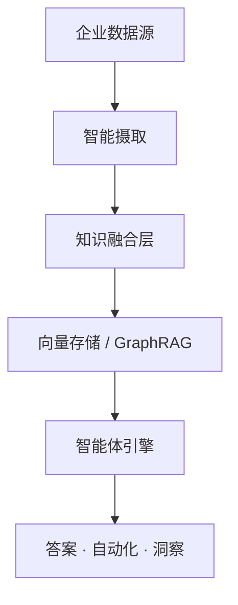

# <p align="center">Clouisle（云屿）</p>

<p align="center"><b>与您的业务共同演进的企业级智能知识平台</b></p>

<p align="center">
将分散的企业数据转化为可执行的智能——持续、安全、大规模。
</p>

<p align="center">


<a href="https://github.com/yunhai-dev/Clouisle/actions/workflows/ci.yml">
  
</a>
</p>

<p align="center">
<a href="../README.md">English</a> ·
<a href="#为什么选择-clouisle">为什么选择 Clouisle</a> ·
<a href="#架构">架构</a> ·
<a href="#快速开始">快速开始</a> ·
<a href="#使用场景">使用场景</a>
</p>

---

## 为什么选择 Clouisle？

现代企业并不缺乏数据——
他们面临的是**数据碎片化、低复用性和零智能执行**的困境。

知识存在于各处：

* 文档
* 数据库
* 聊天记录
* Wiki
* 内部工具

但当需要做出决策时，这些知识是**静态的**、**孤立的**、**无法执行的**。

**Clouisle 的存在就是为了改变这一现状。**

Clouisle 不仅仅是一个知识库。
它是一个**不断演进的智能层**，持续将企业数据转化为**上下文感知、智能体驱动的执行能力**。

> 将 Clouisle 视为一个**活的系统**，而非存储解决方案。

---

## Clouisle 有何不同？

### 1️⃣ 从存储到智能

传统知识系统止步于*搜索*。
Clouisle 更进一步——实现**推理、决策和行动**。

* 理解关系，而非仅仅关键词
* 跨领域连接知识
* 通过智能体执行工作流

---

### 2️⃣ 为企业现实而构建

Clouisle 专为**真实世界的企业约束**而设计：

* 分布式系统
* 大规模数据
* 安全与合规
* 渐进式采用

每个核心能力都是**模块化、松耦合、可独立扩展的**。

---

### 3️⃣ 原生智能体设计

AI 不是 Clouisle 的附加功能——它是基础。

Clouisle 中的智能体可以：

* 检索和推理知识
* 执行多步骤任务
* 与内部系统集成
* 自动化可重复的工作流

它们不仅仅回答问题——**它们完成工作**。

---

## 核心能力

### 🧠 智能知识演进引擎

**数据摄取**

* 文件、数据库、API、协作工具
* 持续同步
* 架构无关且可扩展

**知识融合**

* 通过智能体增强知识检索（Agentic RAG）
* 分布式向量搜索
* 高精度、低延迟检索

**智能体智能**

* 低代码智能体创建
* Agentic RAG 工作流
* 面向执行的推理

---

## 架构



设计为水平扩展、灵活部署、持续演进。

---

## 快速开始

### 基础设施

```bash
docker-compose -f deploy/docker-compose.yml up -d
```

### 后端

```bash
cd backend
uv sync
uvicorn app.main:app --reload
```

### 前端

```bash
cd frontend
bun install
bun dev
```

---

## 使用场景

| 使用场景                 | 成果                                       |
| ------------------------ | ------------------------------------------ |
| **企业问答**             | 基于内部知识的准确、上下文感知的答案       |
| **工程生产力**           | 更快的入职、更少的重复问题、即时上下文     |
| **合规与风险**           | 自动化合同和政策分析                       |
| **决策智能**             | 为高管和分析师提供跨系统洞察               |

---

## 路线图

* [x] 分布式向量检索
* [x] 多模态文档理解
* [x] Agentic RAG 基础
* [ ] 行业特定智能体模板
* [ ] 更深入的工作流自动化

---

## 许可证

Clouisle 采用 **GPL v3** 许可证开源。

---

<p align="center">
⭐ 给我们点个 Star 支持项目 · 欢迎 PR · 一起构建企业智能的未来
</p>
