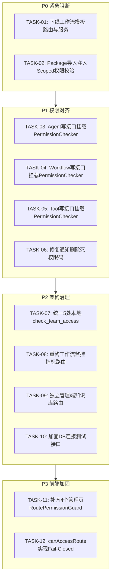

# Clouisle 全栈 RBAC 整改实施清单 (Remediation Plan)

**文档状态**: 已核准待实施  
**生成日期**: 2026-09-14  
**对应审计依据**: `docs/dev/design/access-control/FULL_RBAC_AUDIT_REPORT.md`

本文档将本次 RBAC 深度审计中确认的所有需整改项整理为结构化的任务实施清单，按风险与优先级划分为 **P0（紧急阻断与死代码下线）**、**P1（核心写接口权限补齐）**、**P2（架构收敛与治理）**、**P3（前端守卫与体验加固）** 四个阶段，供后续开发与重构直接执行。

---

## 阶段汇总总览

| 阶段 | 任务数 | 核心目标 | 预估影响 |
| :--- | :---: | :--- | :--- |
| **P0 阶段** | 2 | 封堵高危未授权越权、彻底下线未完工的工作流模板攻击面 | 无破坏性，封堵安全漏洞 |
| **P1 阶段** | 4 | 补齐 Agent / Workflow / Tool 核心写接口全局声明式权限码，激活死权限码 | 严格对齐 RBAC 规范，取消权限时即刻生效 |
| **P2 阶段** | 4 | 统一收敛 5 处本地私有 `check_team_access`，治理管理端路由与测试接口 | 消除逻辑分歧，理顺前后台路由边界 |
| **P3 阶段** | 2 | 补齐 4 个管理页面的 `RoutePermissionGuard`，加固前端未知管理路由默认拒绝 (Fail-Closed) | 改善未授权重定向体验，杜绝漏配风险 |

---

## 全量整改实施清单

| 优先级 | 任务 ID | 模块 / 涉及功能 | 精确文件与代码符号位置 | 现状问题与安全漏洞分析 | 确切整改动作 | 验证与验收标准 |
| :---: | :---: | :--- | :--- | :--- | :--- | :--- |
| **P0** | **TASK-01** | **工作流模板库彻底下线清理** (Workflow Templates Cleanup) | • `backend/app/api/v1/api.py:61-63` • `backend/app/api/v1/workflow_versions.py:423-639` (`template_router`) • `backend/app/services/workflow/templates.py` • `backend/app/services/workflow/executors/template.py` • `backend/tests/services/workflow/test_templates.py` | 前端完全没有模板页面或 API 调用，属于未实现遗留功能。后端残留的 `template_router` 仅需登录态（`get_current_user`），无任何权限码与租户隔离，存在向全系统发布公共模板的供应链投毒与任意删除风险。 | **彻底下线移除**： 1. 从 `api.py` 卸载 `template_router`； 2. 删除 `workflow_versions.py` 中的模板路由定义代码； 3. 清理无引用的模板服务与执行器代码； 4. 移除对应测试用例与关联导入。 | 1. `POST/DELETE /api/v1/workflow-templates` 返回 404； 2. 前端工作流画布与其他功能运行正常，无构建或运行时报错。 |
| **P0** | **TASK-02** | **Package 资产包导入提权防护** (Package Import Permission Guard) | • `backend/app/api/v1/endpoints/packages.py:85-180` • `backend/app/services/clouisle_package.py` • `backend/app/services/clouisle_package_resources.py` | 平台端导入预览和安装只验证了用户属于该 `team_id`，**未校验用户在目标团队中是否有 `agent:create` / `workflow:create` / `kb:create` 权限**。团队只读成员（Viewer）可通过上传 `.clouisle` 资产包在团队内批量创建资源，击穿前端权限限制。 | **注入团队角色创建权限校验**： 在 `ClouislePackageService.preview` 与 `install` 执行资源写入前，调用 `check_scoped_permission(user, f"{resource_type}:create", "team", team_id)`，无权者直接抛出 403 `PERMISSION_DENIED`。 | 1. 团队只读 `Viewer` 角色调用 `/api/v1/packages/import/*` 返回 403； 2. 拥有创建权限的 `Admin/Member` 角色能正常导入。 |
| **P1** | **TASK-03** | **智能体核心写接口补齐权限码** (Agent Create / Update Auth) | • `backend/app/api/v1/endpoints/agents.py:134` (`create_agent`) • `backend/app/api/v1/endpoints/agents.py:252` (`update_agent`) • `backend/app/api/v1/endpoints/agents.py:574` (`duplicate_agent`) | 路由仅依赖 `get_current_active_user` 与内部 `check_agent_access`，未挂载 `agent:create` 与 `agent:update` 的 `PermissionChecker`。若管理员在角色管理中取消某用户的修改/创建权限，该用户通过 API 仍能修改或创建智能体。 | **挂载声明式权限依赖**： 1. `POST ""` 增加 `current_user: User = Depends(deps.PermissionChecker(SystemPermissions.AGENT_CREATE))`； 2. `PUT "/{agent_id}"` 增加 `current_user: User = Depends(deps.PermissionChecker(SystemPermissions.AGENT_UPDATE))`； 3. `POST "/{agent_id}/duplicate"` 增加 `current_user: User = Depends(deps.PermissionChecker(SystemPermissions.AGENT_CREATE))`。 | 被剥夺 `agent:create` 或 `agent:update` 权限的用户调用对应接口直接返回 403，有权用户操作正常。 |
| **P1** | **TASK-04** | **工作流核心写接口补齐权限码** (Workflow Create / Update Auth) | • `backend/app/api/v1/endpoints/workflows.py:322` (`create_workflow`) • `backend/app/api/v1/endpoints/workflows.py:560` (`update_workflow`) • `backend/app/api/v1/endpoints/workflows.py:809` (`duplicate_workflow`) | 路由仅依赖 `get_current_active_user` 与内部 `check_workflow_access`，未挂载 `workflow:create` 与 `workflow:update` 的 `PermissionChecker`，导致角色权限配置失效。 | **挂载声明式权限依赖**： 1. `POST ""` 增加 `PermissionChecker(SystemPermissions.WORKFLOW_CREATE)`； 2. `PUT "/{workflow_id}"` 增加 `PermissionChecker(SystemPermissions.WORKFLOW_UPDATE)`； 3. `POST "/{workflow_id}/duplicate"` 增加 `PermissionChecker(SystemPermissions.WORKFLOW_CREATE)`。 | 被剥夺 `workflow:create` 或 `workflow:update` 权限的用户调用对应接口返回 403。 |
| **P1** | **TASK-05** | **平台工具写/改/删补齐权限码** (Tool Create / Update / Delete Auth) | • `backend/app/api/v1/endpoints/tools.py:165` (`create_tool`) • `backend/app/api/v1/endpoints/tools.py:225` (`update_tool`) • `backend/app/api/v1/endpoints/tools.py:270` (`delete_tool`) | 路由装饰器未配置任何权限码依赖，仅函数内对团队角色做了简单比对。未校验全局 `tool:create`、`tool:update`、`tool:delete` 权限码。 | **挂载声明式权限依赖**： 1. `POST ""` 增加 `PermissionChecker(SystemPermissions.TOOL_CREATE)`； 2. `PUT "/{tool_id}"` 增加 `PermissionChecker(SystemPermissions.TOOL_UPDATE)`； 3. `DELETE "/{tool_id}"` 增加 `PermissionChecker(SystemPermissions.TOOL_DELETE)`。 | 与已有的 `GET /tools` (`tool:read`) 和 `POST /tools/test` (`tool:execute`) 形成完整权限闭环。 |
| **P1** | **TASK-06** | **通知删除死代码与鉴权修复** (Notification Delete API Alignment) | • `backend/app/api/v1/endpoints/notifications.py:784-829` (`admin_delete_notification`) • `backend/app/core/permissions.py:101` (`ADMIN_NOTIFICATION_DELETE`) | 路由遗漏 `PermissionChecker`；函数内硬编码要求 `is_superuser`。导致分配了内置 `admin:notification:delete` 权限的普通 Admin 无法删除全局通知（死权限码）；而无管理权限的团队管理员却能调管理路由删除团队通知。 | **规范管理端鉴权契约**： 1. 端点增加 `PermissionChecker(SystemPermissions.ADMIN_NOTIFICATION_DELETE)`； 2. 允许持有该管理权限的用户删除全局通知； 3. 若需保留团队通知删除，应迁移至平台端 `/api/v1/notifications/{id}` 端点。 | 1. 拥有 `admin:notification:delete` 的 Admin 用户可成功删除全局通知； 2. 普通团队成员无法调用管理端点删除。 |
| **P2** | **TASK-07** | **统一收敛 5 处本地私有 `check_team_access`** (Consolidate Team Access Helpers) | • `backend/app/api/team_access.py` (权威实现) • `backend/app/api/v1/endpoints/conversations.py:64` • `backend/app/api/v1/admin/endpoints/conversations.py:63` • `backend/app/api/v1/endpoints/knowledge_bases.py:301` • `backend/app/services/skill.py:28` | 各模块私自维护独立的 `check_team_access` 函数。在超管绕过、软删除 (`is_deleted`) 过滤、是否支持 `require_admin` 以及抛出的错误状态码（400 / 403 / 404）上存在细微分歧，极易发生安全漏网。 | **全量重构替换**： 1. 删除上述 4 个文件中的私有重复函数； 2. 全量引入并调用 `app.api.team_access.check_team_access`； 3. 同步校准单元测试的 monkeypatch 路径。 | 全局团队访问判断统一对齐：不存在/软删除统一 404，非成员统一 403 `NOT_TEAM_MEMBER`，非 Admin 统一 403 `TEAM_ADMIN_REQUIRED`。 |
| **P2** | **TASK-08** | **工作流全局监控指标路由重构** (Workflow Metrics Route Reorganization) | • `backend/app/api/v1/workflow_metrics.py:25` • `backend/app/api/v1/api.py:59` | 节点耗时性能分析、运行态监控以及底层缓存清理接口（如 `GET /workflows/metrics/dashboard`、`DELETE /workflows/metrics/cache`）挂载在平台路径下，但依赖声明却是 `admin:dashboard:access` 和 `admin:settings:update`，导致权限与路由设计倒置。 | **迁移至管理端路由**： 1. 将全局指标端点纳入 `backend/app/api/v1/admin/` 体系（如 `/api/v1/admin/observability/workflows/metrics`）； 2. 仅保留针对单个工作流的监控端点在平台侧（`GET /workflows/metrics/workflows/{id}`）。 | 1. 管理端指标接口前缀符合 `/api/v1/admin/*` 规范； 2. 平台端路由不再包含仅超管/全局 Admin 能访问的系统级缓存与监控端点。 |
| **P2** | **TASK-09** | **管理端知识库独立路由封装** (Dedicated Admin KB Router) | • `backend/app/api/v1/admin/api.py:68-72` (`platform_knowledge_bases.router`) | 管理端直接 include 了平台端知识库路由，使得平台端专用的 `require_kb_*` 依赖与管理端的 `admin:knowledge-base:*` 权限码产生割裂，导致管理端未能声明式卡住权限。 | **为管理端定制独立路由**： 在 `backend/app/api/v1/admin/endpoints/` 下封装管理专属的知识库端点，显式配置 `admin:knowledge-base:read/create/update/delete/test` 权限检查。 | 系统定义的 5 个 `admin:knowledge-base:*` 权限码在管理端得到真实声明式校验。 |
| **P2** | **TASK-10** | **数据库连通性测试接口加固** (Harden DB Connection Test) | • `backend/app/api/v1/endpoints/tools.py:148` (`POST /tools/database/test-connection`) | 仅依赖 `get_current_active_user`。虽然内部有 SSRF 校验，但任何登录用户均可利用该接口对局域网或外部数据库进行端口连通性探测。 | **增加权限限制**： 挂载 `PermissionChecker("tool:create")` 或要求请求者必须在目标团队拥有 `owner` / `admin` 角色。 | 普通无工具创建权限的成员将被禁止执行外部或内网数据库连通性探测。 |
| **P3** | **TASK-11** | **补齐 4 个管理页面的路由守卫** (Add RoutePermissionGuard to Admin Pages) | • `frontend/app/(dashboard)/teams/page.tsx` • `frontend/app/(dashboard)/knowledge-bases/page.tsx` • `frontend/app/(dashboard)/activities/page.tsx` • `frontend/app/(dashboard)/api-keys/page.tsx` | 这 4 个后台管理页面的 `page.tsx` 未包裹 `RoutePermissionGuard`，仅靠侧边栏菜单隐藏。若普通用户直接敲 URL 访问，页面框架会先渲染，直到内部 API 报 403 才报错，体验不佳。 | **补齐路由守卫**： 在上述 4 个 `page.tsx` 中增加 `<RoutePermissionGuard>` 包裹，未授权访问时直接平滑重定向到 `/app`。 | 无权限用户手动输入这些 URL 时，直接重定向至前台首页，不再先渲染空白页面框架。 |
| **P3** | **TASK-12** | **前端未知管理路由默认拒绝加固** (Fail-Closed Route Guard Strategy) | • `frontend/lib/route-permissions.ts:112-124` (`canAccessRoute`) | `canAccessRoute` 规定：若路由未在 `ROUTE_PERMISSION_CONFIG` 中配置，则默认返回 `true`（放行）。未来若新增管理页面却漏配映射表，前端将失去防线。 | **管理前缀默认拒绝 (Fail-Closed)**： 在 `canAccessRoute` 中增加策略：所有命中后台前缀（如 `/dashboard/`、`/site-settings/`、`/users`、`/roles` 等）但未在表中明确登记的子路径，默认返回 `false`。 | 彻底杜绝前端因漏配路由导致的管理页白屏或越权展示。 |

---

## 依赖关系与推荐执行顺序

