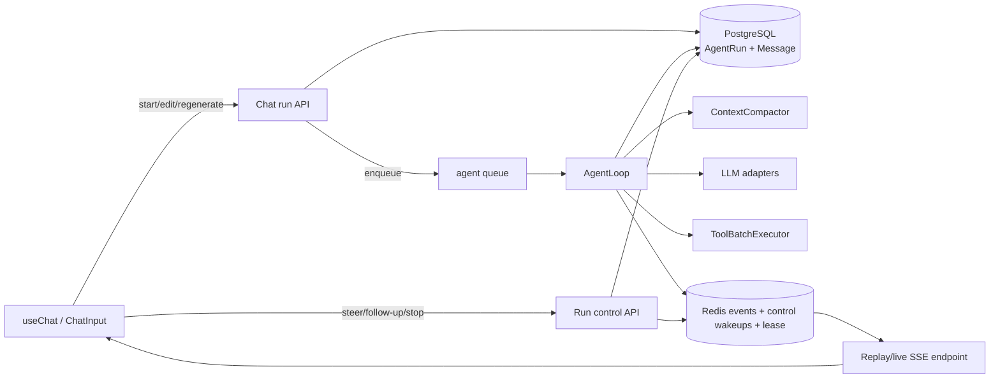

# Oh My Pi Agent Loop Parity Design Document

## Background & Goals

Clouisle 当前 Agent Chat 已具备模型流式输出、工具调用、轮次持久化、编辑/重生成、90% preflight summary 和压缩 SSE，但执行模型仍是“一个 HTTP 请求内的多段 while-loop”：

- `backend/app/api/v1/endpoints/chat.py` 在非流式、普通流式、编辑、重生成四条路径分别维护工具循环；同一行为已经出现四份实现。
- 每个工具调用串行执行；同一模型回合返回多个独立工具调用时无法并发。
- 前端 `useChat.sendMessage()` 在 `isLoading` 时直接返回，`ChatInput` 也在运行中禁用提交；用户只能停止，不能像 Oh My Pi 那样在运行中追加 steering/follow-up。
- `stop()` 只中止浏览器 SSE；服务端依靠连接断开推断“手动停止”。连接丢失、主动停止、切换页面被混为一类，且无法可靠重连。
- SSE 无 `run_id`、无单调 sequence、无事件回放；执行生命周期依赖原始请求连接。
- 上下文压缩在固定 90% 触发后把历史整体替换成 summary + 当前用户消息；不保留 Oh My Pi 的近期原文尾部，也没有按完整 turn/tool protocol 选取 cut point 的迭代压缩。
- LLM 类型只保留 `FinishReason`；provider 的非终止 `pause_turn` 等细节无法进入循环。
- 当前默认 `max_iterations=5` 很容易把正常长任务变成 `max_iterations_reached`，而 Oh My Pi 主要依赖 deadline/abort 和 provider stop 语义。

参考基线固定为 Oh My Pi commit `969062200754ea02cfac922e5ebb8c608c079e15`，重点参考：

- `packages/agent/src/agent-loop.ts`
- `packages/agent/src/compaction/compaction.ts`
- `packages/agent/src/compaction/prompts.ts`
- `packages/agent/src/compaction/types.ts`
- `packages/coding-agent/src/core/agent-session.ts`

### 目标

1. 单一 Agent Loop 驱动普通发送、非流式 API、编辑和重生成，四条入口不再各自实现循环。
2. Agent run 脱离浏览器连接运行；断线可回放/重连，停止是显式服务端命令。
3. 运行中可提交 steering；当前 turn 自然结束后可消费 follow-up，不丢消息、不额外创建竞争 run。
4. 工具批次支持 Oh My Pi 风格 `shared`/`exclusive` 调度；未知或有副作用工具默认保守串行。
5. 上下文压缩改为 reserve-aware、turn-aware、可迭代 summary，并保留最近原文；任何 provider 请求都不得超预算。
6. 正确处理 `pause_turn`、截断 tool call、deadline、stop、工具异常和 worker 丢失；每条终止路径都有明确持久化状态。
7. 前端保持 compression/reasoning/tool/content 的真实到达顺序，并显示运行中输入、停止、重连和队列状态。

### 成功标准

- 一个伪模型脚本完成“模型 → 多工具 → steering → 再次模型 → final”，所有消息/工具结果按协议持久化且只有一个 canonical assistant message。
- 浏览器 SSE 断开后 run 继续；使用 `after_sequence` 重连时事件不缺失、不重复渲染。
- 点击停止会服务端确认并落库为 `stopped`；单纯切换页面不会停止 run。
- 压缩后保留 previous summary、完整近期 turn 和未完成 tool protocol；重新估算仍超预算时 fail fast，模型 adapter 未被调用。
- 普通发送、非流式、编辑、重生成共享同一个 loop contract；删除四份重复工具循环。
- 独立 shared 工具真实重叠执行；exclusive 工具前后无重叠，provider 接收的 tool results 仍按原 tool-call 顺序。

## Scope Decisions

### 本次复刻

- Agent turn loop、工具调度、run 生命周期、steering/follow-up、显式 stop、事件回放。
- 上下文预算、自动 compaction、previous-summary 增量更新、近期原文保留、协议边界保护。
- provider stop details 和 `pause_turn` continuation。
- Web Chat 所需的 API、前端状态机、双语文案、部署 worker wiring。

### 不盲目移植

- Oh My Pi 的 CLI/TUI、subagent hub、skills、LSP/browser 集成、session JSONL、git/worktree、模型目录和遥测系统。
- 不复制 TypeScript 实现到 Python；只复刻可观察语义，并沿用 Clouisle 的 Tortoise、Celery、Redis、SSE 和 Message branch 模型。
- 不恢复旧的多层 checkpoint/session-memory/tool-step compaction。只保留一个 turn-aware compaction pipeline，避免并存两套压缩策略。

## Current-to-Target Gap Matrix

| Area | Current Clouisle | Target parity |
|---|---|---|
| Loop ownership | `chat.py` 四份 while-loop | `AgentLoop` 单一状态机；入口只准备 round/branch |
| Execution lifetime | SSE request generator 内运行 | Celery agent task；SSE 只是订阅者 |
| Run identity | 只有 conversation/round/message id | durable `AgentRun` + run_id + status + lease |
| Event delivery | live-only SSE，无 sequence | Redis buffer + Pub/Sub + monotonic sequence + replay |
| Stop | abort browser fetch，靠 disconnect 推断 | `POST .../stop` cooperative cancellation，收到终态再收尾 |
| Disconnect | 被当作 stop | 只断订阅；run 继续 |
| Mid-run input | loading 时拒绝 | queued steering/follow-up；worker 在安全边界消费 |
| Tool batch | 全部串行 | consecutive shared 并发；exclusive barrier；unknown exclusive |
| Provider stop | 仅 `FinishReason` | `StopDetails`；`pause_turn` 最多连续续采样 8 次 |
| Length with tool call | 发 truncated 后结束/不完整 | 为未执行 call 配对 skipped/error result；必要时继续一轮 |
| Loop guard | 默认 5 iterations | deadline 为主；可选显式 hard cap，默认不以 5 次截断新 Agent |
| Compression trigger | 固定 context × 90% | `context - max(15%, output reserve)` reserve-aware trigger |
| Compression retained context | summary + current user | previous summary + compacted old turns + recent verbatim turns |
| Cut point | watermark/历史整体 | complete round/tool group 边界；active protocol 永不截断 |
| Frontend state | 一个 fetch + React state closure | run/session refs + sequence reducer + reconnect + queued input |

## High-Level Design



### Core runtime objects

#### `AgentRun`

Durable database record; authorization and terminal truth must not depend on Redis TTL.

- `id`, `agent_id`, `conversation_id`, `user_id`
- `mode`: `send | edit | regenerate | non_stream`
- `status`: `queued | running | stopping | completed | stopped | failed | interrupted`
- `celery_task_id`, `active_round_id`, `canonical_message_id`, `source_message_id`
- `started_at`, `finished_at`, `updated_at`, `error_code`, `error_message`

A Redis conversation lock (`agent:conversation:{conversation_id}:active_run`) prevents two workers from mutating one visible branch concurrently. Lock has heartbeat/lease and value matching `run_id`; only owner may refresh/release it.

Worker loss is not auto-replayed: model/tool side effects are not generally idempotent. Expired running leases become `interrupted`; user can explicitly retry/regenerate.

#### `AgentRunInput`

Durable queued user/control input so Redis wakeup loss does not lose messages.

- `id`, `run_id`, `sequence`, `kind`: `steer | follow_up | stop`
- `content`, supported attachment metadata, `status`: `queued | consumed | dropped`
- `created_at`, `consumed_at`

Redis Pub/Sub only wakes the worker. PostgreSQL is the authoritative queue; consumption uses row locking and ordered sequence. A consumed steering/follow-up is converted into a normal `Message` with the worker-owned next `round_index`, so DB ordering has no API/worker race.

#### `AgentLoop`

One async state machine, independent from FastAPI and SSE formatting:

1. Load run/round context and tools.
2. Consume queued steering at a safe boundary.
3. Build and finalize provider context; emit compression events if needed.
4. Stream one model turn into ordered domain events.
5. Persist assistant step.
6. Execute the tool batch and persist one result for every tool call, including error/skipped results.
7. Continue for tools, `pause_turn`, steering, or follow-up; otherwise commit canonical assistant and terminal run state.

The loop emits typed `AgentRunEvent` values. Redis persistence happens before publication. FastAPI only serializes/replays events; non-stream API consumes the same run to terminal and returns the persisted canonical message.

### Event contract

Every event payload includes:

```text
run_id: UUID
sequence: monotonically increasing integer within run
timestamp: ISO-8601
round_id?: UUID
message_id?: UUID
```

Retain current event names where their payload is already public: `message_start`, `content_delta`, `reasoning_*`, `tool_call`, `tool_result`, `media_result`, `compression_*`, `output_truncated`, `iteration_cap_reached`, `message_end`, `error`.

Add:

- `run_start`: durable run identity/status.
- `input_accepted`: queued input committed to a message and injected.
- `run_status`: `queued/running/stopping/reconnecting` transitions.
- `run_end`: exactly one terminal event with `completed/stopped/failed/interrupted`.

`message_end` remains per assistant round; `run_end` is per AgentRun. The frontend deduplicates by `(run_id, sequence)`, not event body.

### Run APIs

Preserve existing public starts while moving implementation behind the run service:

- `POST /agents/{agent_id}/chat/stream`
- `POST /agents/{agent_id}/chat`
- `POST /agents/{agent_id}/messages/{message_id}/edit/stream`
- `POST /agents/{agent_id}/messages/{message_id}/regenerate`

Add run control/subscription:

- `GET /agents/{agent_id}/chat/runs/{run_id}`
- `GET /agents/{agent_id}/chat/runs/{run_id}/events?after_sequence=N`
- `POST /agents/{agent_id}/chat/runs/{run_id}/inputs` with `delivery: steer | follow_up | auto`
- `POST /agents/{agent_id}/chat/runs/{run_id}/stop`

`auto` is resolved atomically: while the loop is mid-work it becomes steering; at the final boundary it becomes follow-up; after terminal transition the client starts a new run normally. Ownership checks require matching agent, conversation and authenticated user/API key scope.

### Context compaction contract

1. Estimate the complete provider payload: normalized messages, reasoning/tool-call serialization, images, current tool definitions, provider framing and output reserve.
2. Trigger when input exceeds `context_limit - effective_reserve`, with `effective_reserve = max(floor(context_limit × 0.15), model output reserve)`.
3. Select a cut point at complete `round_id`/assistant-tool protocol boundaries.
4. Carry `Conversation.context_summary_text`; summarize only newly covered old turns, then move `context_summary_watermark_id` to the last newly covered message.
5. Keep a recent verbatim tail. Default target mirrors Oh My Pi’s 20k tokens but is clamped for small windows so system + summary + current/active turn + output reserve always fit.
6. If a single old completed turn is too large, split only on complete assistant/tool groups and summarize the prefix. Never split an unfinished current tool protocol.
7. Re-estimate after summary. One bounded retry may shorten summary/reduce retained old tail at safe boundaries. If protected content alone cannot fit, raise `ContextLengthError` before the provider call.
8. Persist summary only after successful generation and branch/watermark validation. A watermark outside the active branch is ignored and full active history is replanned.
9. Compression remains an ordered message part. `compression_start` is emitted at the actual loop position; `compression_end` updates that event in place in the UI.

### Tool scheduling contract

Runtime metadata (not sent to the model) declares `concurrency: shared | exclusive`.

- Pure/read-only built-ins may opt into `shared`.
- filesystem mutation, shell/code execution, media jobs, user-defined HTTP/custom/MCP and unknown tools default to `exclusive`.
- Consecutive shared calls execute concurrently; an exclusive call waits for all earlier shared calls and blocks later calls until complete.
- SSE tool results may arrive as each call finishes, but persistence and provider tool-result messages are reordered to the model’s original tool-call order.
- Every call receives one result. Validation failure, tool exception, stop, deadline and truncated arguments produce explicit error/skipped tool results; no orphan tool call enters provider history.
- Steering is consumed between model turns and tool scheduling barriers. Already-running side-effecting tools are not force-killed; unstarted calls may be skipped with protocol-complete results. Explicit stop cancels interruptible model/network tasks, then waits for non-interruptible cleanup before terminal persistence.

## Implementation Plan

### Stage 1: Freeze behavioral contracts and register the work

**Files modified**

- `docs/IMPLEMENTATION_PLAN.md`
- `docs/plan/oh-my-pi-agent-loop-parity.md`
- focused backend/frontend contract test files

**Specific logic**

- Add the high-level checklist and this design document to the repository.
- Add characterization tests around the existing visible contracts before extraction: normal tool round, tool exception, manual stop, edit/regenerate branch activation, compression event ordering and message finalization.
- Use fake model streams and fake tools; do not change production behavior in this stage.

**Validation**

- Existing focused chat/context suites pass unchanged.
- New characterization tests fail if event order, branch activation or persisted round structure changes accidentally.

### Stage 2: Extract one event-driven Agent Loop without changing transport

**Files modified**

- New `backend/app/services/agent_loop.py`
- New `backend/app/services/agent_loop_events.py`
- New `backend/app/services/agent_round.py` (round/message persistence only)
- `backend/app/api/v1/endpoints/chat.py`
- `backend/app/api/v1/endpoints/chat_helpers/tool_executor.py`
- corresponding backend tests

**Specific logic**

- Define `AgentLoopContext`, `AgentLoopResult`, typed loop events and a provider/tool interface.
- Move model-turn accumulation, usage aggregation, intermediate assistant/tool persistence, canonical finalization and loop termination into `AgentLoop`.
- Keep request preparation (access, RAG, assets, branch/version selection) in route-level services; pass a prepared round target into the loop.
- Make ordinary stream, non-stream, edit and regenerate call the same loop. Non-stream collects events/result rather than maintaining a second while-loop.
- Delete the four old tool-loop bodies after every caller is migrated; no compatibility copy remains.

**Validation**

- Contract tests prove all four entry paths produce the same loop behavior and round trace.
- Verify model → tool → result → final with actual production loop code and a fake adapter.
- Ruff/format/type diagnostics for touched backend modules.

### Stage 3: Implement Oh My Pi-style turn-aware compaction

**Files modified**

- `backend/app/services/chat_context.py`
- context summary prompt module used by `chat_context.py`
- `backend/app/models/agent.py` only if an additional compaction boundary field is proven necessary; prefer existing summary + watermark
- `backend/app/schemas/agent.py`
- `frontend/lib/api/agents.ts`
- focused context tests

**Specific logic**

- Replace fixed 90% whole-history replacement with reserve-aware trigger and recent-tail retention.
- Group history by round/tool protocol and implement safe cut-point selection.
- Incrementally update previous summary with only newly covered messages.
- Support oversized completed-turn prefix compaction without touching active/incomplete tool groups.
- Recount the finalized provider payload; bounded retry then fail fast if protected content cannot fit.
- Preserve current compression metric fields, but make `summary_source_tokens` describe only newly summarized source and keep full-payload `before_tokens/after_tokens` separate.
- Remove obsolete simple-summary assumptions/tests rather than adding shims.

**Validation**

- Previous summary at head + several old tool groups + recent tail: summary remains and every recent assistant/tool pair remains.
- Active tool call without result is never summarized or dropped.
- Images and tool definitions can independently trigger compaction.
- Branch watermark mismatch falls back safely.
- Protected payload over budget raises before model adapter invocation.
- Summary failure never advances watermark or mutates persisted summary.

### Stage 4: Add durable AgentRun execution and replayable events

**Files modified**

- `backend/app/models/agent.py` or new `backend/app/models/agent_run.py`
- `backend/app/models/__init__.py`
- `backend/app/core/init_data.py` only for existing-schema upgrade/backfill required by the chosen table layout
- New `backend/app/services/agent_run_store.py`
- New `backend/app/services/agent_run_stream.py`
- New `backend/app/tasks/agent.py`
- `backend/app/core/celery.py`
- `backend/app/api/v1/endpoints/chat.py`
- `backend/app/schemas/agent.py`
- `deploy/docker-compose.yml`, Helm worker values/template, and canonical K8s manifest queue arguments
- focused model/store/task/API tests

**Specific logic**

- Add `AgentRun` and `AgentRunInput` models/status enums.
- Add Redis lease/active-conversation lock, sequence counter, bounded event list and Pub/Sub channel. Follow the existing workflow `StreamManager` replay-before-live pattern; factor only the small generic buffer primitive if it can be shared without changing workflow semantics.
- Start loop execution through a no-retry Celery task on an `agent` queue; add the module to Celery includes/routes and make deployed workers consume that queue.
- SSE endpoints subscribe to buffered/live events and no longer own loop execution. Disconnect closes only the subscription.
- Add run status and replay endpoints with strict owner/team/API-key checks.
- Detect expired leases and mark runs `interrupted`; never replay side-effecting work automatically.

**Validation**

- Worker publishes before subscriber: sequence 0 replays full buffered run.
- Disconnect then reconnect after sequence N: exactly N+1 onward is delivered.
- Two starts for one conversation: only one acquires active mutation lock.
- Wrong user/agent cannot inspect or control a run.
- Worker loss/lease expiry creates one interrupted terminal state and releases lock.
- Deployment commands include the agent queue.

### Stage 5: Add steering, follow-up and explicit cooperative stop

**Files modified**

- `backend/app/services/agent_loop.py`
- `backend/app/services/agent_run_store.py`
- `backend/app/api/v1/endpoints/chat.py`
- `backend/app/schemas/agent.py`
- `frontend/lib/api/agents.ts`
- focused backend tests

**Specific logic**

- Add durable input/control endpoint and Pub/Sub wakeup.
- At each safe loop boundary, lock and consume ordered queued inputs. Steering enters the current work context; follow-up starts the next logical round in the same run after the current assistant round finalizes.
- Close the terminal race with an atomic `running → completing → terminal` transition: inputs accepted before `completing` are consumed; inputs after terminal start a normal new run.
- Replace disconnect-based manual-stop logic with explicit stop command. Stop moves run to `stopping`, interrupts the current model stream cooperatively, completes all tool protocol pairs, persists partial content, then emits exactly one `run_end: stopped`.
- Make repeated input/stop requests idempotent by client request id.

**Validation**

- Steering queued during model output appears before the next provider call.
- Steering queued during a tool batch is not lost and is injected at the first safe boundary.
- Follow-up arriving at the final boundary creates a new round and keeps the run alive.
- Repeated stop is idempotent; stopped canonical message preserves partial content/reasoning and trace.
- SSE disconnect alone leaves status running.

### Stage 6: Preserve provider stop semantics and improve termination guards

**Files modified**

- `backend/app/llm/types/chat.py`
- `backend/app/llm/types/__init__.py`
- `backend/app/llm/adapters/chat/base.py`
- all chat adapters that expose stop metadata
- `backend/app/services/agent_loop.py`
- Agent configuration schema/UI only where loop cap semantics are exposed
- adapter and loop tests

**Specific logic**

- Add `StopDetails` to non-stream and stream response types; map provider-native metadata where available without inventing unsupported details.
- Treat `stop + pause_turn` as non-terminal and resample with the assistant message replayed, capped at 8 consecutive continuations; reset after a tool-call turn.
- For `length` with tool calls, pair every incomplete/unrunnable call with a skipped/error tool result before any continuation.
- Keep deadline/global timeout as the primary normal guard. Change new-Agent iteration configuration from an implicit low default to an optional explicit hard cap; preserve existing explicitly stored values rather than silently rewriting them.
- Terminal reason is persisted in run/message status and emitted to UI; no generic “completed” for cap, timeout or stop.

**Validation**

- `pause_turn` continues and the ninth consecutive pause terminates deterministically.
- A normal `stop` does not spuriously continue.
- Length-truncated tool calls leave no orphan protocol messages.
- Deadline, explicit cap, user stop, provider error and completed each map to distinct terminal state.

### Stage 7: Add safe shared/exclusive tool batch scheduling

**Files modified**

- `backend/app/llm/tools/registry.py`
- tool metadata/types in `backend/app/llm/tools/base.py` or existing nearest type
- `backend/app/api/v1/endpoints/chat_helpers/tool_executor.py`
- `backend/app/services/agent_loop.py`
- built-in tool registrations that are demonstrably read-only
- focused scheduler tests

**Specific logic**

- Add runtime `concurrency` metadata with conservative `exclusive` default.
- Implement ordered batch scheduler: concurrent runs of shared calls, exclusive barriers, stable provider result order.
- Emit per-call lifecycle events and persist each result exactly once.
- Check stop/steering between barriers; skip unstarted calls with explicit protocol-complete results.
- Do not classify custom/MCP/HTTP/sandbox mutation tools as shared without evidence.

**Validation**

- Two shared sleep-backed fake tools overlap in wall-clock execution.
- Shared → exclusive → shared ordering has no overlap across the exclusive barrier.
- Completion order may differ, but provider/persistence order matches original tool calls.
- One tool failure does not discard sibling results or abort the whole loop unless the tool explicitly marks terminal.

### Stage 8: Frontend run state machine and ongoing-input UX

**Files modified**

- `frontend/hooks/use-chat.ts`
- `frontend/lib/api/agents.ts`
- `frontend/components/chat/chat-input.tsx`
- `frontend/app/(chat)/chat/[id]/page.tsx`
- `frontend/app/(chat)/run/[id]/_components/agent-run-page.tsx`
- `frontend/i18n/en/chat.json`
- `frontend/i18n/zh/chat.json`
- focused frontend tests

**Specific logic**

- Replace one-request assumptions with refs for `runId`, `lastSequence`, subscription abort and queued request ids; React state remains rendering state only.
- Parse run envelopes and apply events through one idempotent sequence reducer shared by send/edit/regenerate/reconnect.
- While running, composer submit calls run-input API instead of returning early. Show accepted steering/follow-up as queued/committed user messages.
- Stop sends the service command first and waits for stopped terminal event; subscription abort is reserved for unmount/switch/reconnect.
- On mount/conversation switch, query active run and subscribe after the last applied sequence.
- Preserve ordered assistant `parts`; compression stays at its actual event position.
- Make queued attachment behavior explicit. If Stage 5 supports attachment resolution end-to-end, allow it; otherwise disable attachments only during active run with localized explanation rather than silently dropping files.

**Validation**

- Submit while streaming reaches input API and is not ignored.
- Replayed events do not duplicate content/tool cards or message_end effects.
- Switching conversations stops local subscription but not the server run; switching back reconnects.
- Stop UI transitions `stopping → stopped` from server events.
- Send/edit/regenerate all use the same reducer and pass timeline-order tests.
- TypeScript, changed-file ESLint and i18n lint pass.

### Stage 9: End-to-end verification, cleanup and documentation finalization

**Files modified**

- touched focused tests and docs only as failures/contract gaps require
- `docs/IMPLEMENTATION_PLAN.md`
- `docs/plan/oh-my-pi-agent-loop-parity.md`

**Specific logic**

- Remove superseded route-local loop helpers, stale comments, old disconnect-stop assumptions and obsolete simple-summary tests.
- Update API schema/docs for run control and event envelope.
- Mark each implementation stage complete only after its focused proof passes.

**Validation**

1. Backend focused suites: loop, context, run store/stream, task, chat endpoints, adapters, tool scheduler.
2. Frontend focused suites: `use-chat`, message rendering, chat input and both chat pages.
3. Backend Ruff/format, frontend TypeScript/ESLint/i18n.
4. Full backend and frontend test/coverage gates after focused checks are green.
5. Behavioral smoke through production loop code: scripted fake provider performs two tool turns, a compaction, steering, reconnect and stop/final completion.
6. Actual browser/service smoke only if explicitly permitted by the user, because repository rules prohibit starting services/browser sessions without that permission.

## Testing Strategy

### Happy paths

- Text-only final response.
- One and multiple tool rounds.
- Concurrent shared tools and exclusive barriers.
- Steering during generation and during tools.
- Follow-up after current round.
- Automatic compaction followed by successful continuation.
- Edit and regenerate with branch/version activation.
- SSE reconnect and event replay.
- Non-stream API consuming the same AgentLoop result.

### Negative/error paths

- Invalid tool JSON, unknown tool, timeout and exception.
- Provider stream error before and after partial output.
- `length` with partial tool calls.
- Repeated `pause_turn` beyond cap.
- Summary timeout/error and summary still over budget.
- Protected current payload larger than budget.
- Stop during model, shared batch and exclusive tool cleanup.
- Worker lease expiry, duplicate Celery delivery and duplicate control request.
- Unauthorized run subscribe/control.
- Active branch changed while a regenerate run is in flight.

### Regression scope

- Message versions/branch activation and canonical round payloads.
- RAG and conversation image inventory.
- Sandbox session and generated media results.
- Token/cache accounting across multiple model turns and compaction calls.
- Compression UI ordering/metrics.
- API-key chat, public chat and internal Agent run page.
- Message statistics and audit logs.

## Risks & Mitigation

### Long-lived Celery tasks consume worker slots

- Route to explicit `agent` queue and expose worker concurrency independently if production load requires it.
- Keep deadline/lease; never allow an unbounded orphan task.
- Rollback: route starts back to inline execution while retaining shared AgentLoop; run-control/replay temporarily disabled.

### Worker crash after side-effecting tool execution

- Never auto-retry Agent task or replay a run after lease loss.
- Persist assistant/tool steps immediately and mark run interrupted.
- User explicitly regenerates/retries from visible trace.

### Concurrent branch mutation

- One active-run Redis lock per conversation plus DB state checks before canonical commit.
- Edit/regenerate branch activation occurs only after successful/explicitly stopped trace commit; failure restores original active branch.

### Redis event loss or TTL expiry

- DB is terminal/source-of-truth; Redis is replay transport and wakeup only.
- Reconnect after replay expiry reloads persisted messages/run status and resumes only live events from current sequence.

### Unsafe tool cancellation

- Cooperative stop; unknown/side-effecting tools are exclusive and not force-killed mid-commit.
- Every skipped/canceled call gets a protocol result.

### Summary information loss

- Keep recent raw turns, carry previous summary, protect active protocol, and test the pre-existing-summary + compacted-middle + recent-tail case.
- Summary/watermark update is atomic and only after successful branch validation.

### Scope/rollback

Stages are intentionally separable:

- Stage 2 can ship as a behavior-preserving loop extraction.
- Stage 3 can roll back to current compactor without reverting the loop.
- Stages 4–5 (durable run/queue) roll back together while keeping shared loop.
- Stage 6 stop details and Stage 7 tool scheduler can roll back independently.
- Stage 8 frontend only activates run controls after backend event/API contract exists.

## Implementation Order and Commit Boundaries

1. `docs/tests: register parity contract and characterization`
2. `refactor(agent): centralize chat execution in AgentLoop`
3. `feat(context): add turn-aware iterative compaction`
4. `feat(agent-run): add durable worker execution and event replay`
5. `feat(agent-run): add steering follow-up and cooperative stop`
6. `feat(llm): preserve provider stop details and continuation semantics`
7. `feat(tools): schedule shared and exclusive tool batches`
8. `feat(chat): add reconnectable run UX and ongoing input`
9. `test/docs: complete parity regression and cleanup`

Each commit must pass its focused validation and contain no dormant alternate implementation.
## Verification Record (2026-08-31 worktree)

### Backend
- Full suite: `uv run pytest -q` → 6673 passed, 0 failed (started this session at 6616 passed / 149 failed / 19 errors).
- Ruff (`uv run ruff check app/ tests/`) clean; `compileall` clean.
- Obsolete session-memory/compression-retry test remnants removed: `should_retry_context_length` and `get_compression_trigger` stage/pressure mapping (retired contract), `stale_session_memory_*` / `ConversationSessionMemoryStatus` suites, `chat.StreamIdleTimeoutError` references re-pointed to `chat_helpers.stream_utils`.
- ~130 legacy issue255 loop/internal tests migrated or superseded by the durable suites: endpoint files now assert the durable route contract (enqueue + wait + adapter, `start_chat_run` + `sse_events` passthrough, edit/regenerate branch preparation); loop-level tests deleted where `test_agent_run_durable.py`, `test_agent_run_steering_stop.py`, `test_agent_loop_behavioral_smoke.py` and `test_tool_batch_scheduler.py` already assert the same behavior. Superseded files carry a pointer docstring.
- Token-counter tests updated to the image-budget accounting contract (`IMAGE_TOKEN_ESTIMATE` now counts vision items; required by Stage 3 compaction triggers).
- Production gaps found and fixed during migration: `main.py start_worker` default queues now include `agent`; `admin_observability.WORKER_QUEUES` includes `agent` (catalog + queue-length observability); `SANDBOX_WORKER_ENV_KEYS` includes `INTERNAL_API_TOKEN` (sandbox container needs it); sandbox env test made hermetic against `app.main` import-time `dotenv` pollution.

### Frontend
- Focused parity suites (use-chat ×3, use-run ×2, chat-input, message, agent-run-page, chat-behavior) pass with `--isolate`: 54/54 across 7 files.
- Run-status chip + reconnect button covered by the `agent-run-page` test; `use-run` delegates `runId`/`runStatus`/`reconnect` to `useChat`.
- ChatInput streaming contract test updated: submit stays enabled while streaming (steering), disabled while uploading/disabled; loading keeps submit enabled.
- `bun run tsc --noEmit`, changed-file ESLint (0 errors), `i18n:lint`, `git diff --check` all clean.
- Full frontend suite: 2254 passed / 0 failed across 513 files. Added the missing React 19 `jsx-runtime` exports to five manual test mocks and `packagesApi` to the admin-workflow package mock; no unhandled module errors remain.

### Commit state
- Stages 1–7 were committed incrementally on `fix/simple-context-summary`; the Stage 8/9 implementation and backend migration are in `3e3084f9`, with the final frontend test-harness fixes and this verification record in the follow-up commit.
